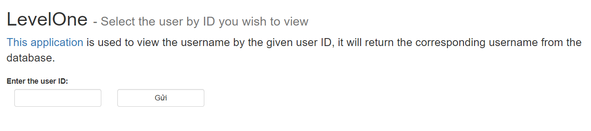

# Babysteps

## Level 01

Description: Nothing fancy
<h3>Cách 1:</h3>

<a href="https://websec.fr/level01/">Link challenge</a>
Khi mới truy cập vào web ta sẽ được một form như sau: 
</img>
Khi nhìn vào câu dẫn ta có thể nhận ra ngay đây là một dạng bài vê SQLi rồi nhỉ?
Để kiểm tra ta có thể nhập thử <code>'</code>, site sẽ thông báo ngay lỗi: </img>. Hoặc có thể đọc source của site ở <a href="https://websec.fr/level01/source.php">Link source</a>.
=> DB đang sử dụng là SQLite3
Bây giờ sẽ cần tìm xem số cột của bảng là bao nhiêu. 
Mình sẽ nhập số một cách bình thường. Ở đây mình nhập là 1. Site trả về kết quả:
</img>
=> mình đã tìm được số cột của bảng là 2 cột.
Sau đó mình dùng payload <code>1 and 1=0 UNION SELECT sql,2 FROM sqlite_master-- </code> để dò thông tin từ bảng, thu được: 
</img>
=> Tên bảng là 'users' và có 3 thuộc tính là id, username, password

Vì chỉ crawl được thông tin của 1 dòng nên ta sẽ phải fuzz từng dòng.
Payload để có flag: <code>1 and 1=0 UNION SELECT username|| '-' || password, 2 FROM users LIMIT 2,1-- </code>
=> flag: WEBSEC{Simple_SQLite_Injection}
<h3>Cách 2:</h3>
Payload để tìm ra tên bảng:
<Code>-1 UNION SELECT 'xyz', GROUP_CONCAT(sql) FROM sqlite_master;--</Code>
Payload để lấy ra password:
<Code>-1 UNION SELECT 'xyz', GROUP_CONCAT(password) FROM users;--</Code>
