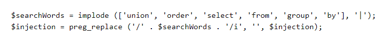

# Easy

## Level 02
Description: <Code>Nothing fancy, with a twist</Code>

<a href="https://websec.fr/level02/">Link challenge</a>. 
</img> 
Đọc câu dẫn và check qua <a href="https://websec.fr/level02/source.php">source code</a> ta thấy là lv2 tương tự với lv1 nhưng có một điểm khác ở đây đó là ở lv2 có sử dụng hàm <code>preg_repace()</code> với các từ: <code>union, order, select, from, group, by</code> 
Cụ thể trong source code: </img> 
Đoạn code này mang ý nghĩa là sẽ xóa (thay các từ trong blacklist bằng '') các từ dc nhập vào nếu nằm trong list $searchWords. 
Vì vậy ta sẽ dùng payload giống với lv1 nhưng sẽ khác là với các từ bị filter ta sẽ chuyển thành: SELECT --> <code>SESELECT</code>, FROM --><Code>FRFROMOM</Code>,... 
Payload để lấy flag:
<code>-1 UNIOUNIONN SELECSELECTT 'xyz', GROUGROUPP_CONCAT(password) FROFROMM users;-- </code> 
Flag:<code>WEBSEC{BecauseBlacklistsAreOftenAgoodIdea}</code>